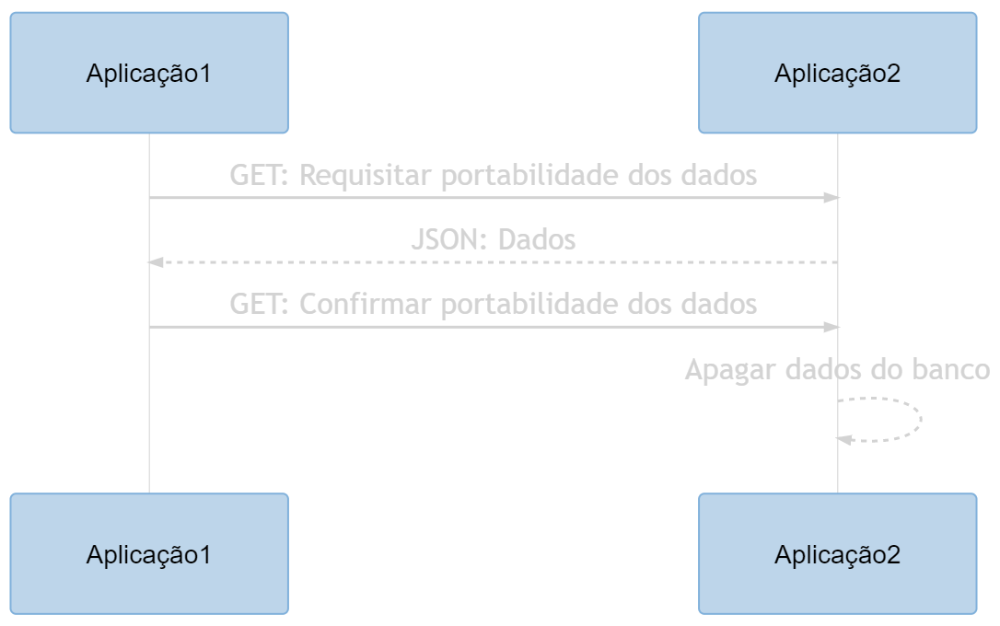
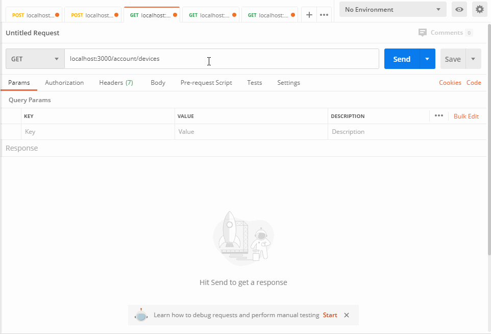
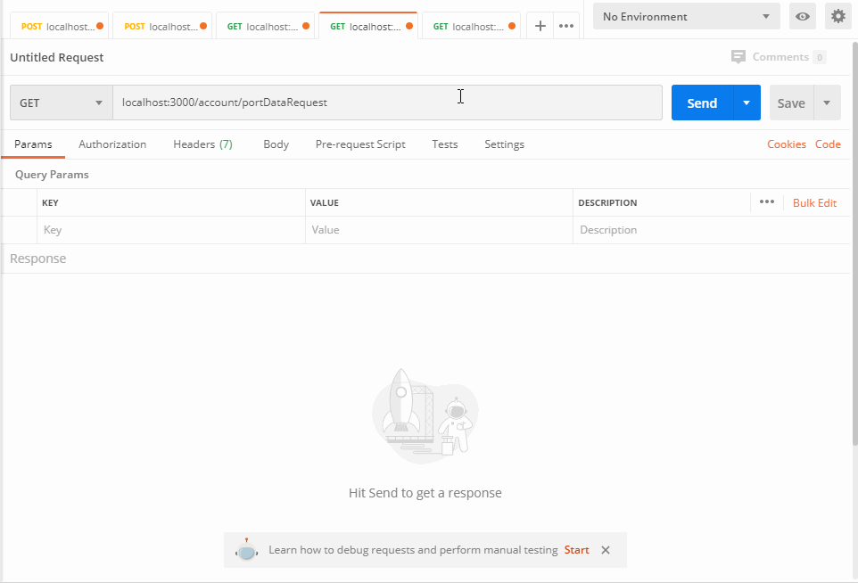
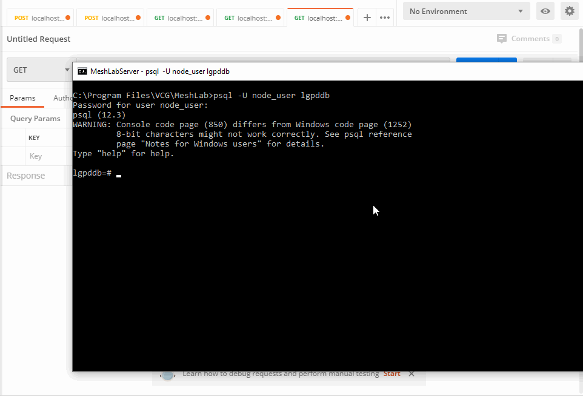

# Seguranca da Informacao
Projeto sobre LGPD desenvolvido nas aulas de Seguranca da Informação da Fatec SJC.

Para o desenvolvimento do projeto, foi escolhido um sistema para o gerenciamento de dispositivos IoT.

## Integrantes: 
Victor de Souza Dias Carvalho Goulart

## Tema: 
Portabilidade de dados

## Tecnologias utilizadas:
-  Node.js

-  React

-  PostgreSQL

# Sprint 4: Rotas para requisitar portabilidade dos dados e criptografia
Nessa sprint foram definidas duas rotas, uma para requisitar a portabilidade dos dados e outra para indicar que a operação ocorreu com sucesso. Além das rotas, também foi implementado a criptografia dos dados sendo portados. O diagrama a seguir demonstra a sequência de eventos entre as aplicações.

*Diagrama criado utilizando o [mermaid live editor](https://mermaid-js.github.io/mermaid-live-editor/)*

# Demonstração
Para as demonstrações, foi utilizado o software Postman .

## 1. Mostrando os dados dos dispositivos

## 2. Requisitando a portabilidade, enviando a chave pública e recebendo um JSON com os dados criptografados

## 3. Descriptografando os dados

## 4. Sinalizando que a operação occorreu com sucesso e apagando os dados do banco
